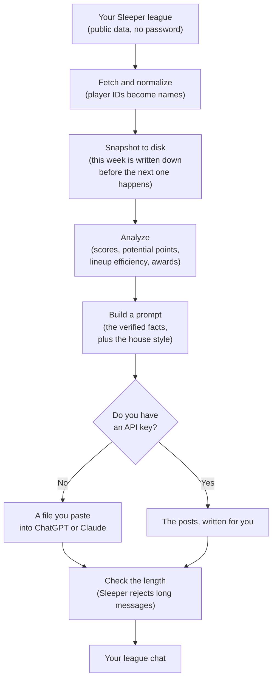
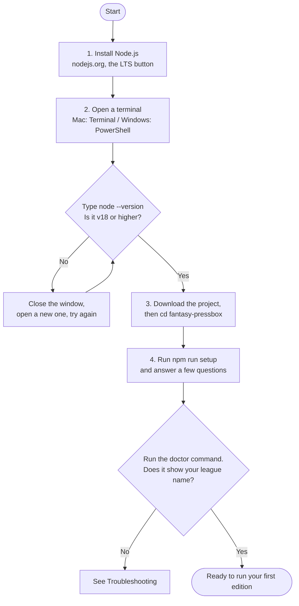
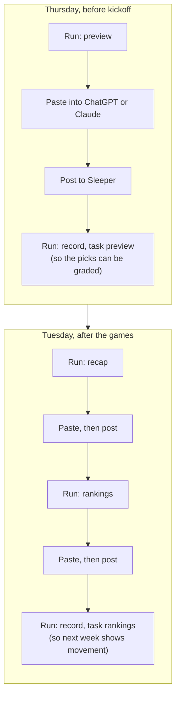

# Fantasy Pressbox

**AI-powered fantasy football league coverage from Sleeper data: power
rankings, previews, recaps, awards, and trash talk.**

Fantasy Pressbox reads your Sleeper league, works out what actually happened,
and writes the weekly content you post in your league chat — in a consistent
voice, with real numbers, week after week.

It is not a chatbot that guesses. Every score, roster and record it prints
comes from your league's real data.

---

## Contents

- [What you get](#what-you-get)
- [How it works](#how-it-works)
- [Results vary between runs](#the-same-prompt-will-not-give-the-same-answer-twice)
- [Requirements](#requirements)
- [Installation](#installation-step-by-step)
- [Setup](#setup)
- [Your weekly routine](#your-weekly-routine)
- [Commands](#commands)
- [Two ways to write the posts](#two-ways-to-write-the-posts)
- [Configuration](#configuration)
  - [Changing the rank emoji](#-changing-the-rank-emoji)
- [Where files go](#where-files-go)
- [Troubleshooting](#troubleshooting)
- [What it costs](#what-it-costs)
- [For developers](#for-developers)

---

## What you get

Four kinds of content, all built from your league's real data:

| Edition | What it is |
|---|---|
| **Preseason power rankings** | A ranking of every team before a snap is played. Deliberately blind to results, so it can be held against you later. |
| **Weekly previews** | One post per matchup, with a called shot on the winner and the score. |
| **Weekly recaps** | The autopsy: who won, who left points on the bench, who got exposed. Plus awards. |
| **Weekly power rankings** | A fresh 1-to-N with movement arrows against last week. |

Here is the kind of thing it produces — this is real output from a real
league, and every number in it came out of Sleeper:

```
WEEK 1 RECAP • 5/8

😤 CERTIFIED LOVER BOYS 111.32
🔥 APOLOGIES IN ADVANCE 85.98

Sometimes you win because you were excellent.

Sometimes your opponent scores 85.98.

Apologies managed the lowest score of Week 1 and set only 73% of its
optimal lineup.

VERDICT: Certified Lover Boys escaped with the win. Apologies in Advance
finally delivered on the name.
```

It also keeps receipts. Because it records what it predicted, next week's
recap can open by admitting it went 2-4.

---

## How it works


In words, if that diagram does not render: your league data is fetched and
translated into names and numbers, saved to disk so this week can never be
rewritten later, analyzed into facts and awards, then combined with the house
style into a prompt. You either paste that prompt into a chat or let the tool
call an API. Either way the finished posts are length-checked before they
reach your league.

Two ideas do most of the work:

**The data is the source of truth.** The AI is handed a block of verified
facts and told, in strong terms, that it may not invent a single one. It
decides what is *interesting*; it never decides what is *true*.

**The publication remembers.** Every week is saved before the next one
happens. That is what makes movement arrows, graded predictions and
"we ranked you 12th and you led the league in scoring" possible.

## The same prompt will not give the same answer twice

This is worth understanding before you or anyone in your league is surprised
by it.

Fantasy Pressbox guarantees the **facts**. It does not guarantee the
**opinions**, because the opinions are formed fresh by the AI on every run.

| Always the same | Varies every run |
|---|---|
| Scores, records, rosters | Where a team is ranked |
| Potential points, lineup efficiency | Movement arrows *(they follow from the order)* |
| Award winners and their numbers | Which teams are grouped into which tier |
| Who plays whom | The wording, jokes and verdicts |
| The facts available to be written about | Predicted scores, and which storyline leads |

Movement arrows are worth a word of their own. They are always *arithmetically*
correct — `record` recomputes them from your saved history and would flag a
wrong one — but they are computed from that run's ranking order. A team placed
9th in one run and 7th in another honestly shows ↑3 in the first and ↑5 in the
second.

Here is a real example. The same Week 1 rankings prompt, run twice in two
fresh ChatGPT sessions, produced:

| Team | First run | Second run |
|---|---|---|
| Virginia Virgins | 9th | 7th |
| Apologies in Advance | 7th | 8th |
| Mid Squids | 4th | 5th |

Every number in both runs was correct. Both checked out against the league
data completely. They simply weighed a 161-point week from a thin roster
differently, which is a judgement call, and judgement calls are exactly what
a power ranking is.

**What this means in practice:**

- If you regenerate because you didn't like a joke, expect the rankings to
  shift too. It is not a bug and it is not the tool changing its mind about
  the facts.
- If you get an edition you like, **keep it**. Do not regenerate hoping for a
  slightly better version of the same thing.
- Once you publish an edition, run `record` on it. That freezes the order, so
  next week measures movement against what your league actually saw rather
  than against a version that only ever existed in a chat window.
- Two people in your league running the same week will get different
  rankings. The commissioner's copy is the one that counts.

To reduce the variation, make `config/rankings.yml` more opinionated — heavier
weights push harder in a consistent direction. You cannot remove it entirely,
and you probably would not want to; an identical ranking every week would be a
spreadsheet, not a publication.

## Requirements

**One thing: Node.js, version 18 or newer.** That's it.

There are no other packages to install. No Python, no database, no account to
create, and no Sleeper password — Sleeper's data is public and read-only.

You only need an AI API key if you want the posts written automatically. See
[Two ways to write the posts](#two-ways-to-write-the-posts).

---

## Installation, step by step

If you have never done this before, follow all four steps. It takes about ten
minutes, and you only do it once.


The four steps in words: install Node.js, open a terminal and confirm Node
works, download the project and move into its folder, then run setup and check
it with `doctor`.

### Step 1 — Install Node.js

1. Go to **<https://nodejs.org>**
2. Download the button that says **LTS** (it means "the stable one")
3. Open the downloaded file and click through the installer, accepting the
   defaults

### Step 2 — Open a terminal

The terminal is where you type commands. It looks intimidating and is not.

- **On a Mac:** press `Cmd + Space`, type `Terminal`, press Enter.
- **On Windows:** press the Start button, type `PowerShell`, press Enter.

Check that step 1 worked by typing this and pressing Enter:

```bash
node --version
```

You should see something like `v22.14.0`. Any number 18 or higher is fine.

> **If you get "command not found"**, Node did not install correctly, or this
> window was open before you installed it. Close the window, open a new one,
> and try again.

### Step 3 — Get the project onto your computer

If you have `git`, this is one command:

```bash
git clone https://github.com/ryrykeith/fantasy-pressbox.git
```

If you don't, go to the project page on GitHub, click the green **Code**
button, choose **Download ZIP**, and unzip it wherever you like.

Then move into the folder — this tells the terminal which project you mean:

```bash
cd fantasy-pressbox
```

> **Tip:** you can type `cd ` (with a space) and then drag the folder from
> Finder or File Explorer onto the terminal window, which fills in the path
> for you.

### Step 4 — Run setup

```bash
npm run setup
```

That's the install finished. The next section covers what setup asks you.

---

## Setup

`npm run setup` is an interactive questionnaire. It checks your computer,
asks a handful of questions in plain language, and writes your settings file
for you. Press Enter to accept any answer shown in brackets.

It asks for:

**1. Your Sleeper league ID.** Open your league at
[sleeper.com](https://sleeper.com) in a web browser and look at the address
bar. You'll see something like:

```
https://sleeper.com/leagues/1234567890123456789/team
                            └──── this bit ────┘
```

You can paste the entire address — setup pulls the ID out of it. It then
checks the ID against Sleeper and shows you the league name, so you know
immediately if you grabbed the wrong number.

**2. Whether you want the posts written for you.** Choose "paste it myself"
to use Fantasy Pressbox for free. You can change this later.

**3. How it should sound.** Humorous, analytical, or unhinged.

**4. Your Sleeper post length limit.** 900 characters is a safe default.

Your answers are saved to a file called `.env` in the project folder. That
file stays on your computer and is never committed to git. You can re-run
`npm run setup` any time to change your answers — your previous settings are
backed up first.

When it finishes, check everything works:

```bash
node src/cli.mjs doctor
```

You should see your league name, your team count, and your league format.

---

## Your weekly routine


Twice a week, in the project folder. Thursday you build previews and record
the picks; Tuesday you build the recap and the rankings, and record the new
order. The two `record` steps are what give the publication its memory — skip
them and you lose graded predictions and movement arrows.

Once a week, in the project folder:

### Thursday — before the games

```bash
node src/cli.mjs preview
```

This writes a file into the `output` folder. Give that file to
[ChatGPT](https://chatgpt.com) or [Claude](https://claude.ai) — either drag it
in as an attachment, or open it and copy the whole thing into the message box.

On a Mac, this puts the entire file on your clipboard in one step:

```bash
cat output/2026-week02-preview-prompt.md | pbcopy
```

Start a **new chat** rather than continuing an old one. The file carries
everything needed — your league, the scores, the house style — so there is
nothing to explain and nothing to type alongside it.

Send it. You'll get back a set of previews, one per matchup, each short enough
to post in Sleeper.

Copy the reply into a file and record it, so next week can grade the picks:

```bash
node src/cli.mjs record output/my-previews.txt --task preview
```

### Tuesday — after the games

```bash
node src/cli.mjs recap
```

Same routine. This one grades last week's predictions automatically, so the
recap can open by admitting what it got wrong.

Then the rankings:

```bash
node src/cli.mjs rankings
```

And record them, so next week's edition can show movement arrows:

```bash
node src/cli.mjs record output/my-rankings.txt --task rankings
```

### Posting it

The output is split into separate posts, divided by a line containing `%%%`.
Post each chunk separately in Sleeper — the chat there does not render
formatting and rejects very long messages, which is why the content is
already broken up and length-checked for you.

For your iMessage group chat, add `--format imessage` to get one longer
consolidated message instead:

```bash
node src/cli.mjs rankings --format imessage
```

---

## Commands

Run them all from inside the project folder.

| Command | What it does |
|---|---|
| `npm run setup` | Interactive setup. Run this first. |
| `node src/cli.mjs doctor` | Checks your settings and connection. Run this when something is wrong. |
| `node src/cli.mjs preview` | Build this week's matchup previews. |
| `node src/cli.mjs recap` | Build last week's recap and awards. |
| `node src/cli.mjs rankings` | Build the power rankings. |
| `node src/cli.mjs preseason-rankings` | Build preseason rankings, ignoring all results. |
| `node src/cli.mjs fetch` | Just download and save a week of league data. |
| `node src/cli.mjs record <file> --task <name>` | File a finished edition you pasted back from a chat. |
| `node src/cli.mjs check <file>` | Check a file of posts against the Sleeper length limit. |
| `node src/cli.mjs grade` | Show how last week's predictions actually did. |

Useful options:

| Option | What it does |
|---|---|
| `--week 3` | Work on a specific week instead of the current one. |
| `--format imessage` | One long message instead of Sleeper-sized posts. |
| `--generate` | Call the AI for you and write finished posts. |
| `--refresh-players` | Re-download the NFL player list instead of using the cached copy. |

---

## Two ways to write the posts

### Paste it yourself (free)

The default. Fantasy Pressbox writes a prompt file; you paste it into ChatGPT
or Claude in your browser and copy the answer back. Costs nothing beyond
whatever chat account you already have.

The trade-off is two copy-and-paste steps each week, and you need to run
`record` afterwards for the project to remember what was published.

### Let it write (paid API)

Add an API key to your `.env` — or re-run `npm run setup` and choose Claude or
ChatGPT — then add `--generate` to any command:

```bash
node src/cli.mjs recap --generate
```

The finished posts are written straight into the `output` folder, predictions
and rankings are recorded automatically, and every post is length-checked.

An API key is **not** the same as a ChatGPT Plus or Claude Pro subscription.
It's a separate developer account that bills per use. See
[what it costs](#what-it-costs).

---

## Configuration

### `.env` — your league and your keys

Created by `npm run setup`. Holds your league ID, any API keys, and a few
overrides. Never commit this file; `.gitignore` already prevents it.

`.env.example` documents every available setting.

**`LEAGUE_FORMAT`** is worth knowing about: it says what kind of league yours is
— `dynasty`, `redraft` or `guillotine`. Leave it empty and the tool works it out
from Sleeper, which can tell dynasty from redraft on its own. It cannot tell a
**guillotine** league, because that format is run by the commissioner by hand and
Sleeper still reports an ordinary head-to-head league — so declare that one
yourself. `node src/cli.mjs doctor` prints what the tool decided and whether it
was told or guessed.

### `config/editorial.yml` — how it sounds

Plain text you can edit in any text editor. Change a value, save, run again.

- `tone` and `roast_intensity` — the voice
- `output.sleeper_max_chars` — the per-post character limit
- `output.include_emoji` — emoji on or off everywhere
- `ranking_emoji` — the emoji next to each rank, covered just below
- `awards` — which weekly awards can be handed out
- `banned_phrases` — filler you never want to see printed

### 🥇 Changing the rank emoji

This is the setting people most want to change, so it gets its own section.

Every team gets an emoji based on where it ranks. The emoji shows up twice —
beside the team in its own post, and beside it again in the tier list that
closes the edition:

```
🥇 1. WIZARDBEEF ↑2
🥈 2. CHEFLAMB1738 —
💩 12. APOLOGIES IN ADVANCE ↓8
```

**To change them, open `config/editorial.yml` and edit this block:**

```yaml
ranking_emoji:
  1: "🥇"
  2: "🥈"
  3: "🥉"
  4: "🔥"
  # ...and so on
```

The number on the left is the rank. The emoji on the right is what prints for
whoever finishes there. Keep the quotes, save the file, done — there is
nothing to reinstall or restart.

**See exactly what you'll get** before generating anything:

```bash
node src/cli.mjs doctor
```

It prints your finished table against your real number of teams:

```
  Rank emoji         1🥇  2🥈  3🥉  4🔥  5😤  6👀  7🤨  8🎲  9🫠  10💩  11💩  12💩
                     Edit these in config/editorial.yml
```

**Things worth knowing:**

| If you… | Then… |
|---|---|
| Have more teams than emoji | The last emoji repeats, and `doctor` warns you |
| Have fewer teams than emoji | The extras are simply never used |
| Write your own list | It **replaces** the default completely — no leftovers mixed in |
| Want no emoji at all | Set `include_emoji: false` and the whole scheme switches off |

**A few ideas**

Kinder to the bottom of the table:

```yaml
ranking_emoji:
  1: "🏆"
  2: "🥈"
  3: "🥉"
  4: "📈"
  5: "📈"
  6: "➖"
  7: "➖"
  8: "➖"
  9: "📉"
  10: "📉"
  11: "🧊"
  12: "🧊"
```

Same emoji for everyone, so the ranking number does the talking:

```yaml
ranking_emoji:
  1: "🏈"
```

A 14-team league — just keep going:

```yaml
ranking_emoji:
  1: "🥇"
  # ...
  13: "💀"
  14: "💀"
```

Because the emoji are read from config rather than written into the prompt,
changing them changes every edition from that point on: rankings, previews and
recaps alike.

### `config/rankings.yml` — how teams are judged

- `weights` — how much starting lineup, dynasty value, depth, quarterback
  play, draft capital, flexibility and contender status each count. They
  should add up to `1.0`.
- `weekly.max_normal_movement` — how far a team normally moves in one week.
  One Sunday is a small sample, and the rankings should act like it.

### `prompts/` — what it writes

One Markdown file per edition, plus `system.md`, which defines the voice and
the rules the AI is not allowed to break. If you want a different structure,
a different number of posts, or a different house style, edit these — they are
just instructions, in English.

---

## Where files go

```
fantasy-pressbox/
├── config/          settings you edit
├── prompts/         the instructions given to the AI
├── src/             the code
├── data/            your league's saved history — stays on your computer
│   ├── raw/           exactly what Sleeper returned
│   ├── snapshots/     each week, analyzed and frozen
│   ├── rankings/      every ranking you've published
│   └── predictions/   every pick you've made
├── output/          the files you paste into a chat, and the finished posts
├── docs/            how the project is designed
└── .env             your settings (never committed)
```

`data/` is the project's memory. Deleting it loses your movement arrows and
prediction history, so leave it alone.

---

## Troubleshooting

**`command not found: node`**
Node isn't installed, or this terminal window was opened before you installed
it. Close the window, open a new one, try again. If it still fails, reinstall
from <https://nodejs.org>.

**`No SLEEPER_LEAGUE_ID found`**
You haven't run setup yet. Run `npm run setup`.

**`Sleeper has no league with ID ...`**
The ID is wrong. Open your league in a web browser and copy the long number
out of the address bar. Make sure it's your *league* ID, not your user ID.

**`Could not reach Sleeper`**
Check your internet connection. Sleeper may also be briefly down — wait a
minute and try again.

**Week 1 works but this week is empty**
The games haven't been scored yet. Sleeper fills scores in as they happen. The
tool warns you when a week has no scores rather than inventing them.

**The posts are too long for Sleeper**
The tool tells you which ones and by how much — it never silently cuts a post
in half. Trim them by hand, or lower `sleeper_max_chars` in
`config/editorial.yml` so the AI aims smaller next time.

**ChatGPT describes the file instead of writing the posts**

If it summarises the prompt and asks what you'd like it to do — "generate the
rankings, review the prompt, or use it as the basis for a workflow?" — it has
treated your attachment as a document to discuss rather than a job to do.

Every prompt file now opens by telling the assistant it is a ready-to-run
assignment, which prevents this. If you still see it — on an older generated
file, or with a different assistant — you have two fixes:

- Regenerate the file (`node src/cli.mjs rankings`) so it includes the header,
  and send it in a **new** chat.
- Or just reply `Follow the file.` It will then produce the edition normally.

Pasting the file's contents into the message box, rather than attaching it,
also avoids this.

**The AI made something up**
Report it. That's the one bug this project treats as serious. Check the prompt
file in `output/` and confirm whether the fact was in the JSON block — if it
wasn't, the prompt rules need tightening.

**Something else**
Run `node src/cli.mjs doctor`. It checks each piece and tells you which one is
unhappy. For full error details, set `DEBUG=true` in `.env`.

---

## What it costs

**Sleeper data: free.** The API is public and requires no account.

**Paste-it-yourself: free.** Any ChatGPT or Claude account, including the free
tiers, can take the prompt.

**`--generate`: paid per run.** You are billed by Anthropic or OpenAI for the
tokens used. A weekly edition for a 12-team league sends roughly 15,000–25,000
tokens and gets a few thousand back, which at current prices lands in the
region of a few cents to a few tens of cents per edition, depending on the
model you choose. Check your provider's current pricing, and set a spending
limit in their dashboard if you want a hard ceiling.

---

## For developers

The design rules live in [`AGENTS.md`](AGENTS.md) and [`docs/`](docs/):

- [`docs/architecture.md`](docs/architecture.md) — the pipeline and why the
  stages are separate
- [`docs/editorial-model.md`](docs/editorial-model.md) — ranking philosophy,
  voice, awards, receipts
- [`docs/prompt-design.md`](docs/prompt-design.md) — how a prompt is assembled
- [`docs/sleeper-data.md`](docs/sleeper-data.md) — endpoints and data shapes

`npm test` runs the suite in `tests/` with Node's built-in test runner. No test
framework is installed, and none should be.

The short version:

- Zero runtime dependencies, on purpose. The install story for a non-developer
  is the product.
- `fetch → normalize → snapshot → analyze → prompt → generate → validate →
  render`, each in its own module. Sleeper's field names stop at
  `src/sleeper/`.
- No league-specific value is ever hard-coded. Not a team, not a player, not a
  league ID.
- History is append-only. A ranking published in week 2 is never recomputed
  with week 5's information.

Adding another fantasy platform means writing a new client and normalizer that
produce the same shapes; nothing downstream should need to change.

## License

MIT. See [LICENSE](LICENSE).
