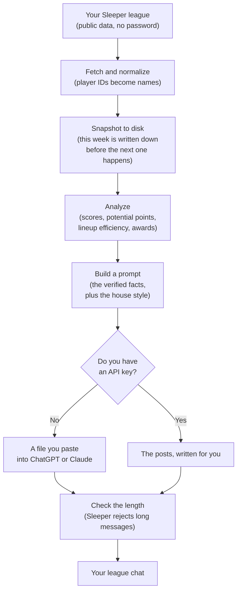
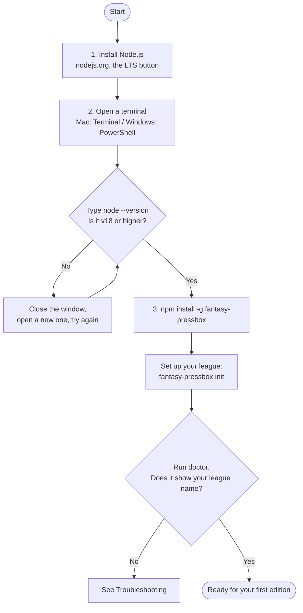
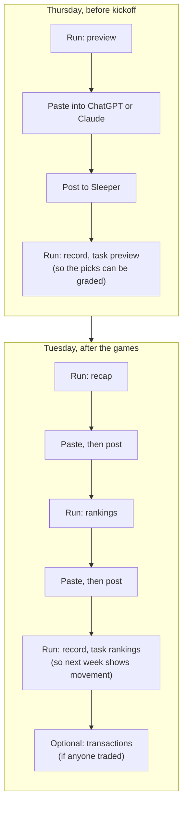

# Fantasy Pressbox

**AI-powered fantasy football league coverage from Sleeper data: power
rankings, previews, recaps, awards, and trash talk.**

Fantasy Pressbox reads your Sleeper league, works out what actually happened,
and writes the weekly content you post in your league chat — in a consistent
voice, with real numbers, week after week.

It is not a chatbot that guesses. Every score, roster and record it prints
comes from your league's real data.

---

## Contents

- [What you get](#what-you-get)
- [How it works](#how-it-works)
- [Results vary between runs](#the-same-prompt-will-not-give-the-same-answer-twice)
- [Requirements](#requirements)
- [Install](#install-step-by-step)
- [Set up your league](#set-up-your-league)
- [What your league format changes](#what-your-league-format-changes)
- [Your first edition](#your-first-edition)
- [Your weekly routine](#your-weekly-routine)
- [Commands](#commands)
- [Two ways to write the posts](#two-ways-to-write-the-posts)
- [Configuration](#configuration)
  - [Changing the rank emoji](#-changing-the-rank-emoji)
- [Where files go](#where-files-go)
- [Troubleshooting](#troubleshooting)
- [What it costs](#what-it-costs)
- [For developers](#for-developers)

---

## What you get

Every edition is built from your league's real data:

| Edition | What it is |
|---|---|
| **Preseason power rankings** | A ranking of every team before a snap is played. Deliberately blind to results, so it can be held against you later. |
| **Weekly previews** | One post per matchup, with a called shot on the winner and the score. |
| **Weekly recaps** | The autopsy: who won, who left points on the bench, who got exposed. Plus awards. |
| **Weekly power rankings** | A fresh 1-to-N with movement arrows against last week. |
| **Trade report** | A grade for every trade completed in the week, with the trade market's values and, in dynasty leagues, where each traded pick is projected to land. |
| **Survival preview, chop recap, survival rankings** | The guillotine league versions of the three weekly editions: who is near the chop line, who got chopped, who is safest. |
| **Tank watch** | Dynasty leagues, second half of the season: the race for next year's top rookie picks and who owns them. |
| **Future stock** | Dynasty leagues: every team ranked on the next three seasons rather than this week. |

Here is the kind of thing it produces — this is real output from a real
league, and every number in it came out of Sleeper:

```
WEEK 1 RECAP • 5/8

😤 PUNT INTENDED 108.46
🔥 LOWERED EXPECTATIONS 82.14

Sometimes you win because you were excellent.

Sometimes your opponent scores 82.14.

Lowered Expectations managed the lowest score of Week 1 and set only 73% of its
optimal lineup.

VERDICT: Punt Intended escaped with the win. Lowered Expectations
finally delivered on the name.
```

It also keeps receipts. Because it records what it predicted, next week's
recap can open by admitting it went 2-4.

---

## How it works


```mermaid
flowchart TD
    A["Your Sleeper league<br/>(public data, no password)"] --> B["Fetch and normalize<br/>(player IDs become names)"]
    B --> C["Snapshot to disk<br/>(this week is written down<br/>before the next one happens)"]
    C --> D["Analyze<br/>(scores, potential points,<br/>lineup efficiency, awards)"]
    D --> E["Build a prompt<br/>(the verified facts,<br/>plus the house style)"]
    E --> F{"Do you have<br/>an API key?"}
    F -->|"No"| G["A file you paste<br/>into ChatGPT or Claude"]
    F -->|"Yes"| H["The posts, written for you"]
    G --> I["Check the length<br/>(Sleeper rejects long messages)"]
    H --> I
    I --> J["Your league chat"]
```
In words, if that diagram does not render: your league data is fetched and
translated into names and numbers, saved to disk so this week can never be
rewritten later, analyzed into facts and awards, then combined with the house
style into a prompt. You either paste that prompt into a chat or let the tool
call an API. Either way the finished posts are length-checked before they
reach your league.

Two ideas do most of the work:

**The data is the source of truth.** The AI is handed a block of verified
facts and told, in strong terms, that it may not invent a single one. It
decides what is *interesting*; it never decides what is *true*.

**The publication remembers.** Every week is saved before the next one
happens. That is what makes movement arrows, graded predictions and
"we ranked you 12th and you led the league in scoring" possible.

## The same prompt will not give the same answer twice

This is worth understanding before you or anyone in your league is surprised
by it.

Fantasy Pressbox guarantees the **facts**. It does not guarantee the
**opinions**, because the opinions are formed fresh by the AI on every run.

| Always the same | Varies every run |
|---|---|
| Scores, records, rosters | Where a team is ranked |
| Potential points, lineup efficiency | Movement arrows *(they follow from the order)* |
| Award winners and their numbers | Which teams are grouped into which tier |
| Who plays whom | The wording, jokes and verdicts |
| The facts available to be written about | Predicted scores, and which storyline leads |

Movement arrows are worth a word of their own. They are always *arithmetically*
correct — `record` recomputes them from your saved history and would flag a
wrong one — but they are computed from that run's ranking order. A team placed
9th in one run and 7th in another honestly shows ↑3 in the first and ↑5 in the
second.

Here is a real example. The same Week 1 rankings prompt, run twice in two
fresh ChatGPT sessions, produced:

| Team | First run | Second run |
|---|---|---|
| Bye Week Blues | 9th | 7th |
| Lowered Expectations | 7th | 8th |
| Fantasy Island | 4th | 5th |

Every number in both runs was correct. Both checked out against the league
data completely. They simply weighed a 161-point week from a thin roster
differently, which is a judgement call, and judgement calls are exactly what
a power ranking is.

**What this means in practice:**

- If you regenerate because you didn't like a joke, expect the rankings to
  shift too. It is not a bug and it is not the tool changing its mind about
  the facts.
- If you get an edition you like, **keep it**. Do not regenerate hoping for a
  slightly better version of the same thing.
- Once you publish an edition, run `record` on it. That freezes the order, so
  next week measures movement against what your league actually saw rather
  than against a version that only ever existed in a chat window.
- Two people in your league running the same week will get different
  rankings. The commissioner's copy is the one that counts.

To reduce the variation, make `config/rankings.yml` more opinionated — heavier
weights push harder in a consistent direction. You cannot remove it entirely,
and you probably would not want to; an identical ranking every week would be a
spreadsheet, not a publication.

## Requirements

**One thing: Node.js, version 18 or newer.** It comes with `npm`, which is how
Fantasy Pressbox is installed.

There are no other packages to install. No Python, no database, no account to
create, and no Sleeper password — Sleeper's data is public and read-only.

You only need an AI API key if you want the posts written automatically. See
[Two ways to write the posts](#two-ways-to-write-the-posts).

---

## Install, step by step

If you have never done this before, follow all three steps. It takes about ten
minutes, and you only do it once.


```mermaid
flowchart TD
    S(["Start"]) --> A["1. Install Node.js<br/>nodejs.org, the LTS button"]
    A --> B["2. Open a terminal<br/>Mac: Terminal / Windows: PowerShell"]
    B --> C{"Type node --version<br/>Is it v18 or higher?"}
    C -->|"No"| A2["Close the window,<br/>open a new one, try again"]
    A2 --> C
    C -->|"Yes"| D["3. npm install -g fantasy-pressbox"]
    D --> E["Set up your league:<br/>fantasy-pressbox init"]
    E --> F{"Run doctor.<br/>Does it show your league name?"}
    F -->|"No"| G["See Troubleshooting"]
    F -->|"Yes"| H(["Ready for your first edition"])
```
The steps in words: install Node.js, open a terminal and confirm Node works,
install Fantasy Pressbox with npm, then set up your league and check it with
`doctor`.

### Step 1 — Install Node.js

1. Go to **<https://nodejs.org>**
2. Download the button that says **LTS** (it means "the stable one")
3. Open the downloaded file and click through the installer, accepting the
   defaults

### Step 2 — Open a terminal

The terminal is where you type commands. It looks intimidating and is not.

- **On a Mac:** press `Cmd + Space`, type `Terminal`, press Enter.
- **On Windows:** press the Start button, type `PowerShell`, press Enter.

Check that step 1 worked by typing this and pressing Enter:

```bash
node --version
```

You should see something like `v22.14.0`. Any number 18 or higher is fine.

> **If you get "command not found"**, Node did not install correctly, or this
> window was open before you installed it. Close the window, open a new one,
> and try again.

### Step 3 — Install Fantasy Pressbox

```bash
npm install -g fantasy-pressbox
```

The `-g` makes `fantasy-pressbox` a command you can run from any folder. Check
it worked:

```bash
fantasy-pressbox --help
```

You should see the list of commands.

> **If you get a permissions error** (`EACCES`) on a Mac or Linux, your Node
> install keeps global packages somewhere your user cannot write. The fix
> most people use is to install Node through a version manager such as
> [nvm](https://github.com/nvm-sh/nvm); don't reach for `sudo`.

Updating later is the same command. Your leagues live in their own folders
(next section), so an update never touches them.

---

## Set up your league

Each league gets a folder of its own, holding its settings, its history and
its output. Make one with `init`:

```bash
fantasy-pressbox init --workspace ~/leagues/my-league
```

Use any folder name you like. `init` creates the folder and asks a handful of
questions in plain language. Press Enter to accept any answer shown in
brackets.

> Without `--workspace`, `init` sets up **the folder you are in**. That is
> fine if you made an empty folder and moved into it first; it is not what you
> want in your home folder.

It asks for:

**1. Your Sleeper league ID.** Open your league at
[sleeper.com](https://sleeper.com) in a web browser and look at the address
bar. You'll see something like:

```
https://sleeper.com/leagues/1234567890123456789/team
                            └──── this bit ────┘
```

You can paste the entire address — setup pulls the ID out of it. It then
checks the ID against Sleeper and shows you the league's name, season and
number of teams, so you know immediately if you grabbed the wrong number.

**2. What the publication should call your league.** Sleeper's name is offered.

**3. What kind of league it is.** Dynasty, redraft or guillotine. Setup offers
what Sleeper reports, but Sleeper cannot tell a guillotine league (also called
chopped or elimination) from an ordinary one, so if yours is one, choose it
here. [What your league format changes](#what-your-league-format-changes)
explains what each choice does.

**4. Whether the scoring is right.** Setup shows the scoring Sleeper reports:
PPR, any tight end premium, the passing touchdown value and superflex. Every
edition is written from these, so check them. If they are wrong, they need
fixing in Sleeper.

**5. What your format needs.** A dynasty league is asked how its rookie draft
is ordered (choose from the common rules, or write your own later), whether
later rounds are linear or snake, and optionally when the tank watch opens.
These go in `config/rookie-draft.yml` in the league folder. A guillotine league
gets an empty `config/guillotine.yml` to record each week's elimination in.

**6. Whether you want the posts written for you.** Choose "paste it myself"
to use Fantasy Pressbox for free. You can change this later.

**7. How it should sound.** Humorous, analytical, or unhinged, and your Sleeper
post length limit (900 characters is a safe default).

Your answers are saved to a file called `.env` in the league folder. That file
stays on your computer. Setup checks the folder loads before it finishes, so
every command works straight away with no editing.

Run `init` again on the same folder any time to change your answers: what you
answered before is offered again, nothing is replaced without asking, and your
previous settings are backed up first. A folder that already holds a different
league is not taken over without asking.

When it finishes, move into the league folder and check everything works:

```bash
cd ~/leagues/my-league
fantasy-pressbox doctor
```

You should see your league name, your team count, and your league format.

> Setup's closing message prints commands as `node <path>/src/cli.mjs doctor`.
> That is the same program as `fantasy-pressbox doctor`; use whichever you
> like.

---

## What your league format changes

Setup asks for the format because it decides which editions make sense and
how teams are judged. It is saved as `LEAGUE_FORMAT` in `.env`.

| | Dynasty | Redraft | Guillotine |
|---|---|---|---|
| **Detected from Sleeper?** | Yes | Yes | **No — must be declared** |
| **Weekly editions** | `preview`, `recap`, `rankings` | `preview`, `recap`, `rankings` | `survival-preview`, `chop-recap`, `survival-rankings` |
| **Rankings judge** | This season and the long term: starting lineup, dynasty value, depth, quarterback, future picks | This season only: starting lineup, depth, contender status | Not being last: weekly floor, bye-week exposure, remaining FAAB |
| **Extra editions** | `tank-watch`, `future-stock` | — | — |
| **League config** | `rookie-draft.yml`, a prospect board | — | `guillotine.yml` |

**Why guillotine has to be declared.** In a guillotine league the lowest
scorer each week is eliminated, and the commissioner does that by hand:
removing the chopped team's owner and dropping its players to waivers.
Sleeper's data still describes an ordinary head-to-head league, with matchups
that mean nothing. So Fantasy Pressbox only treats a league as guillotine when
you say so.

Once it knows, it throws Sleeper's meaningless pairings away rather than
printing them. `preview`, `recap` and `rankings` refuse to run and name the
edition that replaces them. `doctor` prints the format the tool is using and
whether it was declared or detected.

`tank-watch` and `future-stock` look at future rookie drafts, so they refuse
redraft and guillotine leagues.

---

## Your first edition

From inside your league folder (or with `--workspace ~/leagues/my-league` added
to each command):

**1. Build the prompt.** Before the season starts, run the preseason rankings;
once games are being played, run the week's rankings (or `survival-rankings`
in a guillotine league):

```bash
fantasy-pressbox rankings
```

It works out which week it is from Sleeper, saves that week's data, and writes
a file into the league folder's `output/` folder. It tells you which one:
`Prompt written to …`.

**2. Get the posts written.** Open [ChatGPT](https://chatgpt.com) or
[Claude](https://claude.ai) and start a **new chat**. Either drag the file in
as an attachment, or open it and copy the whole thing into the message box.
On a Mac, this puts the entire file on your clipboard in one step:

```bash
cat output/2026-week04-rankings-prompt.md | pbcopy
```

The file carries everything needed — your league, the scores, the house style
— so there is nothing to explain and nothing to type alongside it. Send it.

**3. Post it.** The reply is split into separate posts, divided by a line
containing `%%%`. Post each chunk separately in your Sleeper league chat — the
chat there does not render formatting and rejects very long messages, which is
why the content is already broken up for you.

**4. Record it.** Copy the whole reply into a text file in `output/` and file
it:

```bash
fantasy-pressbox record output/my-rankings.txt --task rankings
```

That freezes the order your league actually saw, so next week's rankings show
movement arrows against it. (`--task preseason-rankings` for the preseason
edition.)

That's a full edition. If you set up an API key, add `--generate` to step 1
and it does steps 2 and 4 for you; see
[Two ways to write the posts](#two-ways-to-write-the-posts).

---

## Your weekly routine


```mermaid
flowchart TB
    subgraph T["Thursday, before kickoff"]
        direction TB
        A1["Run: preview"] --> A2["Paste into ChatGPT or Claude"]
        A2 --> A3["Post to Sleeper"]
        A3 --> A4["Run: record, task preview<br/>(so the picks can be graded)"]
    end
    subgraph U["Tuesday, after the games"]
        direction TB
        B1["Run: recap"] --> B2["Paste, then post"]
        B2 --> B3["Run: rankings"]
        B3 --> B4["Paste, then post"]
        B4 --> B5["Run: record, task rankings<br/>(so next week shows movement)"]
        B5 --> B6["Optional: transactions<br/>(if anyone traded)"]
    end
    T --> U
```
Twice a week, from your league folder. Thursday you build previews and record
the picks; Tuesday you build the recap and the rankings, and record the new
order. In a guillotine league the three editions are `survival-preview`,
`chop-recap` and `survival-rankings`; the routine is the same.

### Don't skip `record`

The two `record` steps are the ones people forget, and they are what give the
publication its memory:

- **Without the preview recorded**, there are no picks to grade, so the recap
  cannot say how the predictions did.
- **Without the rankings recorded**, next week measures movement against the
  last ranking that *was* recorded — two or three weeks old — and every arrow
  quietly describes the wrong span. This has happened: one missed week threw
  off a whole season's movement arrows.

Each edition prints which ranking it is measuring movement against
(`Measuring movement against "week-3" rankings.`). If that isn't last week,
you missed a `record`.

Team renames are handled for you. Managers rename teams whenever they like;
`record` pins every name to its Sleeper roster, so a renamed team keeps its
history and its arrow. Each edition lists the renames it noticed. A name in
the reply that matches no team at all is refused rather than filed as a new
team — fix the typo in your file and run `record` again.

### Thursday — before the games

```bash
fantasy-pressbox preview
```

Paste the file into a new chat, post the previews, then copy the reply into a
file and record it, so next week can grade the picks:

```bash
fantasy-pressbox record output/my-previews.txt --task preview
```

### Tuesday — after the games

```bash
fantasy-pressbox recap
```

Same routine. This one grades last week's predictions automatically, so the
recap can open by admitting what it got wrong. (`fantasy-pressbox grade`
shows the same grading on its own.)

Then the rankings, and record them:

```bash
fantasy-pressbox rankings
fantasy-pressbox record output/my-rankings.txt --task rankings
```

If anyone traded, grade it:

```bash
fantasy-pressbox transactions
```

A week with no trades says so and builds no prompt.

### Posting somewhere else

For an iMessage group chat, add `--format imessage` to get one longer
consolidated message instead of Sleeper-sized posts:

```bash
fantasy-pressbox rankings --format imessage
```

---

## Commands

Run every command from inside a league folder, or point it at one with
`--workspace <folder>` (or set `PRESSBOX_WORKSPACE=<folder>` once in your
terminal). Only `init` and `check` work without one.

| Command | What it does |
|---|---|
| `fantasy-pressbox init` | Set up a league folder. Run this first. With `--workspace <folder>` it creates that folder. |
| `fantasy-pressbox doctor` | Check your settings, league config and connection. Run this when something is wrong. |
| `fantasy-pressbox fetch` | Just download and save a week of league data. |
| `fantasy-pressbox preview` | Build this week's matchup previews. |
| `fantasy-pressbox survival-preview` | Build this week's survival preview. Guillotine leagues only — it replaces `preview`. |
| `fantasy-pressbox recap` | Build last week's recap and awards. |
| `fantasy-pressbox chop-recap` | Build last week's chop recap and awards. Guillotine leagues only — it replaces `recap`. |
| `fantasy-pressbox rankings` | Build the power rankings. |
| `fantasy-pressbox survival-rankings` | Build the power rankings for a guillotine league — the teams still alive, ranked on the floor that keeps them there. Guillotine leagues only; it replaces `rankings`. |
| `fantasy-pressbox preseason-rankings` | Build preseason rankings, ignoring all results. |
| `fantasy-pressbox transactions` | Grade the week's trades against the trade market's values. A week with no trades is reported and skipped. |
| `fantasy-pressbox tank-watch` | Build the tank watch: the race for next season's top rookie picks, who owns them, and which picks jump if their team crosses the playoff line. Dynasty leagues only. It needs a declared draft order (see `config/rookie-draft.yml`) and opens from the middle of the regular season. |
| `fantasy-pressbox future-stock` | Rank every team on the next three seasons rather than this week: production by age band, each position's age curve, and priced future picks, with its own weight set (`weights.future_stock` in `config/rankings.yml`). Dynasty leagues only. Not recorded, so it prints no movement arrows. |
| `fantasy-pressbox record <file> --task <name>` | File a finished edition you pasted back from a chat. `<name>` is `preview`, `survival-preview`, `rankings`, `survival-rankings` or `preseason-rankings`. |
| `fantasy-pressbox check <file>` | Check a file of posts against the Sleeper length limit. |
| `fantasy-pressbox grade` | Show how last week's predictions actually did. |
| `fantasy-pressbox migrate <folder>` | Copy this league — `.env`, league settings, `data/` and `output/` — into a new folder. Nothing is removed. See [Moving a league](#moving-a-league). |

Useful options:

| Option | What it does |
|---|---|
| `--week 3` | Work on a specific week instead of the current one. |
| `--format imessage` | One long message instead of Sleeper-sized posts (`sleeper` is the default). |
| `--generate` | Call the AI for you and write finished posts. |
| `--task <name>` | Which edition a file is, for `record`. |
| `--early` | Run the tank watch before its start week. |
| `--refresh-market` | Fetch trade values again instead of reusing the ones saved for that week. |
| `--refresh-players` | Re-download the NFL player list instead of using the cached copy. |
| `--workspace <folder>` | Use a league folder other than the one you are in. `PRESSBOX_WORKSPACE` does the same. |

---

## Two ways to write the posts

### Paste it yourself (free)

The default. Fantasy Pressbox writes a prompt file; you paste it into ChatGPT
or Claude in your browser and copy the answer back. Costs nothing beyond
whatever chat account you already have.

The trade-off is two copy-and-paste steps each week, and you need to run
`record` afterwards for the project to remember what was published.

### Let it write (paid API)

Add an API key to your league's `.env` — or re-run `fantasy-pressbox init` and
choose Claude or ChatGPT — then add `--generate` to any command:

```bash
fantasy-pressbox recap --generate
```

The finished posts are written straight into the `output` folder, predictions
and rankings are recorded automatically, and every post is length-checked.

An API key is **not** the same as a ChatGPT Plus or Claude Pro subscription.
It's a separate developer account that bills per use. See
[what it costs](#what-it-costs).

---

## Configuration

Two kinds of settings, in two places:

- **Your league's own settings** live in your league folder: `.env`,
  `config/rookie-draft.yml`, `config/guillotine.yml` and your prospect board.
  Setup writes the first ones for you.
- **The house style** — `config/editorial.yml`, `config/rankings.yml` and the
  prompts — ships with Fantasy Pressbox. To change it for one league, put a
  file of the same name in that league's folder (below). Never edit the
  installed copies: an update replaces them.

`fantasy-pressbox doctor` shows where your league files were read from and
names every override, so you can always tell which settings are in force.

### `.env` — your league and your keys

Created by `init` in your league folder. Holds your league ID, the league
format, any API keys, and a few overrides. Never share or commit this file.
Every available setting is documented in `.env.example`, which ships with the
package.

**`LEAGUE_FORMAT`** is `dynasty`, `redraft` or `guillotine`. Setup always
fills it in. Left empty, the tool works it out from Sleeper, which can tell
dynasty from redraft but never guillotine — see
[What your league format changes](#what-your-league-format-changes).

### Overriding the house style for one league

Copy the file you want to change into your league folder at the same relative
path, and edit the copy:

- `config/editorial.yml` and `config/rankings.yml` are layered over the shipped
  ones, so your copy only needs the settings you are changing. A list like
  `ranking_emoji`, or a weight set, replaces the shipped one whole.
- `prompts/<name>.md` replaces the shipped prompt of that name; every other
  prompt still comes from the package.

`doctor` names each override it finds, and warns about a prompt file whose name
matches no shipped prompt (it would never be read).

### `config/editorial.yml` — how it sounds

- `tone` and `roast_intensity` — the voice
- `output.sleeper_max_chars` — the per-post character limit
- `output.include_emoji` — emoji on or off everywhere
- `ranking_emoji` — the emoji next to each rank, covered just below
- `awards` — which weekly awards can be handed out
- `banned_phrases` — filler you never want to see printed

### 🥇 Changing the rank emoji

This is the setting people most want to change, so it gets its own section.

Every team gets an emoji based on where it ranks. The emoji shows up twice —
beside the team in its own post, and beside it again in the tier list that
closes the edition:

```
🥇 1. KICKOFF_KINGS ↑2
🥈 2. BENCH MOB —
💩 12. LOWERED EXPECTATIONS ↓8
```

**To change them, create `config/editorial.yml` in your league folder with
this block:**

```yaml
ranking_emoji:
  1: "🥇"
  2: "🥈"
  3: "🥉"
  4: "🔥"
  # ...and so on
```

The number on the left is the rank. The emoji on the right is what prints for
whoever finishes there. Keep the quotes, save the file, done — there is
nothing to reinstall or restart.

**See exactly what you'll get** before generating anything:

```bash
fantasy-pressbox doctor
```

It prints your finished table against your real number of teams:

```
  Rank emoji         1🥇  2🥈  3🥉  4🔥  5😤  6👀  7🤨  8🎲  9🫠  10💩  11💩  12💩
```

**Things worth knowing:**

| If you… | Then… |
|---|---|
| Have more teams than emoji | The last emoji repeats, and `doctor` warns you |
| Have an 18-team league | The default already runs to 18 — guillotine leagues usually start that big, so nothing repeats |
| Have fewer teams than emoji | The extras are simply never used |
| Write your own list | It **replaces** the default completely — no leftovers mixed in |
| Want no emoji at all | Set `include_emoji: false` under `output:` and the whole scheme switches off |

**A few ideas**

Kinder to the bottom of the table:

```yaml
ranking_emoji:
  1: "🏆"
  2: "🥈"
  3: "🥉"
  4: "📈"
  5: "📈"
  6: "➖"
  7: "➖"
  8: "➖"
  9: "📉"
  10: "📉"
  11: "🧊"
  12: "🧊"
```

Same emoji for everyone, so the ranking number does the talking:

```yaml
ranking_emoji:
  1: "🏈"
```

Bigger than 18 — just keep going:

```yaml
ranking_emoji:
  1: "🥇"
  # ...
  19: "💀"
  20: "💀"
```

Because the emoji are read from config rather than written into the prompt,
changing them changes every edition from that point on: rankings, previews and
recaps alike.

### `config/rankings.yml` — how teams are judged

- `weights` — how much each factor counts. There is one set per league format
  (`dynasty`, `redraft`, `guillotine`) plus one for `future-stock`, and each
  set must add up to `1.0`. The `guillotine` set is a different list on
  purpose: in that format you do not need the most points, only to not be
  last, so it weighs a team's weekly **floor**, its bye-week exposure and its
  remaining FAAB — and weighs dynasty value and draft capital at nothing at
  all.
- If you override a set, write out every line it needs. A partial set replaces
  the whole thing rather than merging into the default, so five lines means
  five.
- `weekly.max_normal_movement` — how far a team normally moves in one week.
  One Sunday is a small sample, and the rankings should act like it.

### `config/guillotine.yml` — who has been chopped

Guillotine leagues only. Setup puts an empty one in your league folder. It
holds one thing: the elimination ledger, a list of which week chopped which
team.

```yaml
eliminations:
  1: "Bye Week Blues"
  2: "Faab Hoarders"
```

You have to write this down because Sleeper will not tell anyone. There is no
elimination field — your commissioner runs the format by hand, removing the
chopped team's owner and dumping its players on the waiver wire. Fantasy
Pressbox *can* work out who went by reading the week's scores and then checking
whether that roster has since been emptied, and it does exactly that when you
have not filled a week in. But both halves of that depend on your commissioner
having done the manual work, on time. A commissioner who is a day late leaves
the tool looking at a league that contradicts itself.

So: a week you have written down is settled. A week you have not is reported as
**not resolved**, naming the team that scored lowest, rather than guessed at. If
the two ever disagree, `doctor` says so and names both — it will not quietly
pick one.

Run `fantasy-pressbox doctor` after editing to see the ledger it read.

### `config/rookie-draft.yml` — how the rookie draft is ordered

Dynasty leagues only. Setup writes this from your answers; edit it to change
them. Sleeper does not say how your rookie draft is ordered, so until a rule is
here, Fantasy Pressbox will not project where any pick lands, and `tank-watch`
refuses to run. The rule is a list of groups that pick in turn:

```yaml
order:
  - teams: non_playoff      # the teams that miss the playoffs pick first...
    sort: max_points_for    # ...ordered by max points-for...
    direction: ascending    # ...lowest first
  - teams: playoff
    sort: max_points_for
    direction: ascending
```

`teams` is `non_playoff`, `playoff` or `all`. `sort` is `max_points_for`,
`points_for` or `record`. `direction` is `ascending` (lowest first) or
`descending`. How many teams are in each group comes from your league's number
of playoff teams in Sleeper. A `lottery` sort is recognised but not supported
yet, so a league with one can't be projected. A value that isn't on these lists
stops the command and lists the valid ones.

The same file says how the rounds after the first are ordered:

```yaml
rounds: linear    # or snake
```

`linear` repeats round 1's order every round (the team at 1.07 also picks
2.07); `snake` reverses it in even rounds (1.07 is followed by 2.06 in a
12-team league).

And when the tank watch opens:

```yaml
tank_watch:
  start_week: 8    # the first completed week it covers
```

Leave `start_week` empty to open it at the middle of the regular season (after
week 7 when the playoffs start in week 15). Before then `tank-watch` refuses and
tells you when it opens; `--early` runs it anyway. Each tank watch saves its
projection under `data/tank-watch/`, and the next one reports how every pick
has moved since.

Run `fantasy-pressbox doctor` after editing to see the rule in plain words.

With a rule declared, the trade report grades a traded pick for next season's
draft at its projected slot, for example 1.07. If the pick's original team is
on the playoff bubble, the report also gives the slot the pick would jump to
if that team crossed the line, and names the prospects your board ranks near
that slot. Without a rule, the report won't say where any pick lands.

### `config/prospects.<year>.yml` — who headlines the rookie class

Dynasty leagues only, and optional. Nothing in Sleeper or the trade market
knows the college players, so the rookie class is whatever **you** write down,
with where each claim came from. Fantasy Pressbox never ranks prospects itself
and does not ship a board: a board is your sourced opinion, and one shipped
with the package would go stale between releases.

To start one, copy the example board that ships with the package (all invented
names; setup prints its full path) into your league folder as, for example,
`config/prospects.2027.yml`, and fill it in. It needs `draftYear`, an `updated`
date, and ranked entries, each with `rank`, `name`, `position`, `school`, an
optional short `note`, and a `source` (a publication and/or URL).

A missing source, a repeated rank, or a missing `updated` date stops the command
with a message naming the entry. A prospect who isn't on the board is not
discussed. `doctor` reports the board's age and warns once it is **over 45
days old** — boards move fast in draft season, so refresh it.

### Trade values — fetched for you

The trade report quotes market values from
[FantasyCalc](https://fantasycalc.com), queried for your league's format,
team count and scoring. Nothing to configure. The first `transactions` run
for a week saves the values in `data/market/`, and every later run for that
week reuses them, so a re-run grades against the same numbers rather than
whatever the market says that afternoon. `--refresh-market` fetches them
again. If FantasyCalc can't be reached the edition still runs, and the model
is told not to quote any value.

### Bye weeks — shipped with the package

Guillotine editions weigh how many of a team's starters are on bye in the
coming weeks. Sleeper has no bye-week data, so the package ships a table of
the season's bye weeks (`config/bye-weeks.<season>.yml`), taken from the real
NFL schedule. The maintainer regenerates it each season once the schedule is
out. If your season's table is missing, the guillotine editions stop and say
so rather than pretend nobody has a bye — update the package
(`npm install -g fantasy-pressbox`) to get it.

### `prompts/` — what it writes

One Markdown file per edition, plus `system.md`, which defines the voice and
the rules the AI is not allowed to break. If you want a different structure,
a different number of posts, or a different house style, override them in
your league folder (see above) — they are just instructions, in English.

A few passages only apply to some league formats. They sit between
`<!-- format: dynasty -->` and `<!-- end format -->` lines, and are left out of
the prompt for any other format. Keep those lines intact in your copy.

---

## Where files go

```
~/leagues/my-league/     your league folder: everything that is yours
├── .env             your settings and keys (never share it)
├── config/          your league's own settings, plus any overrides
├── prompts/         (optional) your prompt overrides
├── data/            your league's saved history
│   ├── raw/           exactly what Sleeper returned
│   ├── snapshots/     each week, analyzed and frozen
│   ├── rankings/      every ranking you've published
│   ├── predictions/   every pick you've made
│   ├── tank-watch/    the draft order each tank watch reported
│   ├── market/        the trade values each week was graded against
│   └── cache/         the NFL player list (safe to delete; re-downloaded)
└── output/          the files you paste into a chat, and the finished posts

fantasy-pressbox     the installed package: read, never written to
├── config/          the shipped defaults, templates and bye-week tables
└── prompts/         the instructions given to the AI
```

`data/` is the publication's memory. Deleting it loses your movement arrows and
prediction history, so leave it alone, and back it up with the rest of the
league folder if the history matters to you.

### One folder per league

One install serves as many leagues as you like, each in its own folder, with
nothing shared between them:

```
~/leagues/my-dynasty/            ~/leagues/office-guillotine/
├── .env                         ├── .env
├── config/                      ├── config/
│   ├── rookie-draft.yml         │   └── guillotine.yml
│   └── prospects.2027.yml       ├── data/
├── data/                        └── output/
└── output/
```

- **Make one:** `fantasy-pressbox init --workspace ~/leagues/my-dynasty`.
  Setup never writes a league into the package.
- **Use one:** run commands from inside it, or from anywhere with
  `--workspace ~/leagues/my-dynasty`.
- **Outside a league folder nothing runs.** A folder without a `.env` is not a
  league, so `recap` there stops and tells you to run `init`, rather than
  starting a second, empty history in the wrong place.

### Moving a league

`migrate` copies a league into a new or empty folder:

```bash
fantasy-pressbox migrate ~/leagues/my-dynasty
fantasy-pressbox doctor --workspace ~/leagues/my-dynasty
```

It copies `.env`, your league settings and overrides, and all of `data/` and
`output/` — rankings history, snapshots (which remember renamed teams),
predictions, tank-watch projections and saved trade values. It only copies:
nothing is removed, so check the new folder with `doctor`, run a week from it,
and only then delete the old one yourself.

This is also how you move a league you were running from a clone of the
repository (from before league folders existed) into a folder of its own: run
`node src/cli.mjs migrate ~/leagues/<name>` from the clone.

---

## Troubleshooting

**`command not found: node`**
Node isn't installed, or this terminal window was opened before you installed
it. Close the window, open a new one, try again. If it still fails, reinstall
from <https://nodejs.org>.

**`command not found: fantasy-pressbox`**
The install didn't finish, or it put the command somewhere your terminal
doesn't look. Run `npm install -g fantasy-pressbox` again and read its last
lines; open a new terminal window afterwards.

**`... is not a league folder: it has no .env file`**
You ran a command outside a league folder. Change into your league's folder,
pass `--workspace <folder>`, or run `init` to set a new one up.

**`No SLEEPER_LEAGUE_ID found`**
The league folder's `.env` has no league ID. Run `init` on that folder again.

**`Sleeper has no league with ID ...`**
The ID is wrong. Open your league in a web browser and copy the long number
out of the address bar. Make sure it's your *league* ID, not your user ID.

**`Could not reach Sleeper`**
Check your internet connection. Sleeper may also be briefly down — wait a
minute and try again.

**Week 1 works but this week is empty**
The games haven't been scored yet. Sleeper fills scores in as they happen. The
tool warns you when a week has no scores rather than inventing them.

**The movement arrows look wrong**
Check the line `Measuring movement against "..." rankings.` near the top of the
command's output. If it names an older week than last week's, a `record` was
missed; see [Don't skip `record`](#dont-skip-record).

**`record` refuses a team name**
A name in your file matches no team in the league — usually a typo, or a name
the AI shortened. Fix it in the file and run `record` again. Renamed teams are
recognised on their own.

**The posts are too long for Sleeper**
The tool tells you which ones and by how much — it never silently cuts a post
in half. Trim them by hand, or lower `sleeper_max_chars` in your
`config/editorial.yml` so the AI aims smaller next time.

**ChatGPT describes the file instead of writing the posts**

If it summarises the prompt and asks what you'd like it to do — "generate the
rankings, review the prompt, or use it as the basis for a workflow?" — it has
treated your attachment as a document to discuss rather than a job to do.

Every prompt file opens by telling the assistant it is a ready-to-run
assignment, which prevents this. If you still see it, you have two fixes:

- Regenerate the file (`fantasy-pressbox rankings`) and send it in a **new**
  chat.
- Or just reply `Follow the file.` It will then produce the edition normally.

Pasting the file's contents into the message box, rather than attaching it,
also avoids this.

**The AI made something up**
Report it. That's the one bug this project treats as serious. Check the prompt
file in `output/` and confirm whether the fact was in the JSON block — if it
wasn't, the prompt rules need tightening.

**Something else**
Run `fantasy-pressbox doctor`. It checks each piece and tells you which one is
unhappy. For full error details, set `DEBUG=true` in `.env`.

---

## What it costs

**Sleeper data: free.** The API is public and requires no account.

**Trade values: free.** FantasyCalc's values are public.

**Paste-it-yourself: free.** Any ChatGPT or Claude account, including the free
tiers, can take the prompt.

**`--generate`: paid per run.** You are billed by Anthropic or OpenAI for the
tokens used. A weekly edition for a 12-team league sends roughly 15,000–25,000
tokens and gets a few thousand back, which at current prices lands in the
region of a few cents to a few tens of cents per edition, depending on the
model you choose. Check your provider's current pricing, and set a spending
limit in their dashboard if you want a hard ceiling.

---

## For developers

### Working from a clone

```bash
git clone https://github.com/ryrykeith/fantasy-pressbox.git
cd fantasy-pressbox
npm test
npm run setup
```

There is nothing to install: the package has no dependencies. In a clone,
`node src/cli.mjs <command>` is the same program as `fantasy-pressbox
<command>`, and `npm run setup` is the same as `init`.

`setup.mjs` is the questionnaire `init` runs, and it stays for the clone path,
because a clone has no installed command. Started in the repository's own
folder, it asks where the league folder should go and refuses any folder inside
the repository, so a clone stays a clean package. Don't keep a league's `.env`
in the clone; if you have one there, `migrate` it out (see
[Moving a league](#moving-a-league)).

Each season, regenerate the bye-week table before the season starts:

```bash
node scripts/fetch-bye-weeks.mjs <season>
```

It writes `config/bye-weeks.<season>.yml` from the published NFL schedule and
refuses to write a table that isn't 32 teams with one bye each. Review it and
ship it with a release.

### Design

The design rules live in [`AGENTS.md`](AGENTS.md) and [`docs/`](docs/):

- [`docs/architecture.md`](docs/architecture.md) — the pipeline, why the
  stages are separate, and the package/league-folder split
- [`docs/editorial-model.md`](docs/editorial-model.md) — ranking philosophy,
  voice, awards, receipts
- [`docs/prompt-design.md`](docs/prompt-design.md) — how a prompt is assembled
- [`docs/sleeper-data.md`](docs/sleeper-data.md) — endpoints and data shapes

`npm test` runs the suite in `tests/` with Node's built-in test runner. No test
framework is installed, and none should be.

The short version:

- Zero runtime dependencies, on purpose. The install story for a non-developer
  is the product.
- `fetch → normalize → snapshot → analyze → prompt → generate → validate →
  render`, each in its own module. Sleeper's field names stop at
  `src/sleeper/`.
- No league-specific value is ever hard-coded. Not a team, not a player, not a
  league ID.
- History is append-only. A ranking published in week 2 is never recomputed
  with week 5's information.
- The package is read-only at run time. Every write goes to the league folder.

Adding another fantasy platform means writing a new client and normalizer that
produce the same shapes; nothing downstream should need to change.

## License

MIT. See [LICENSE](LICENSE).
